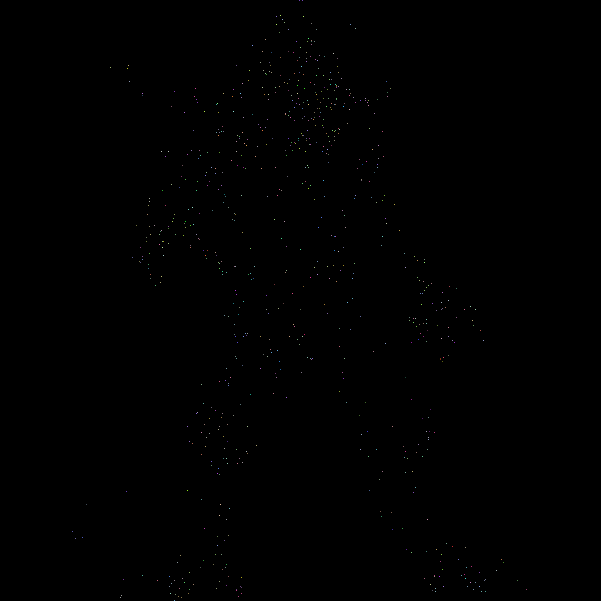
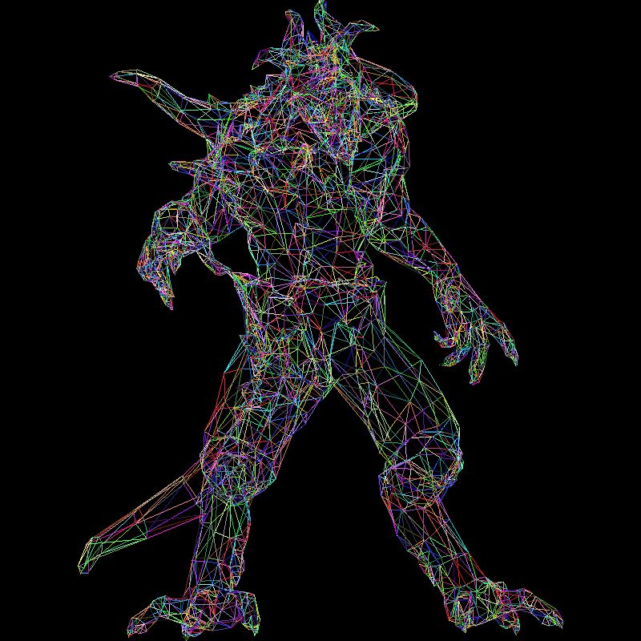
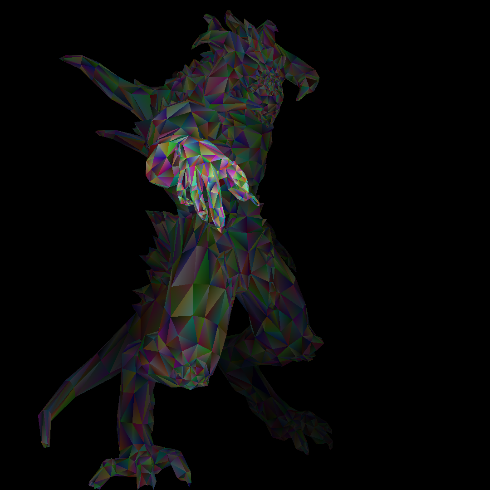
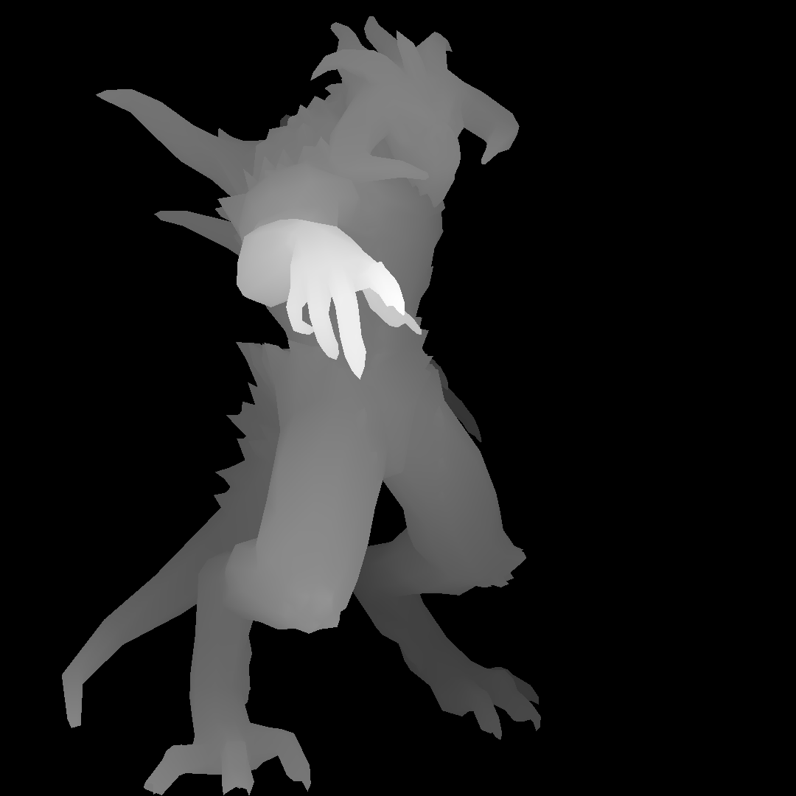
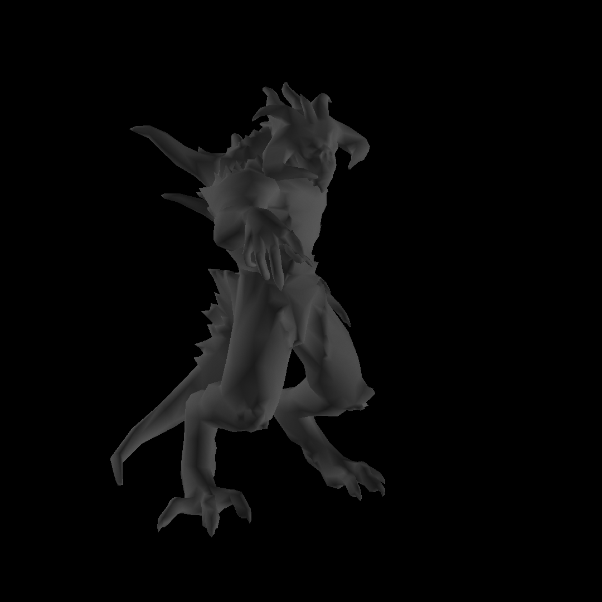
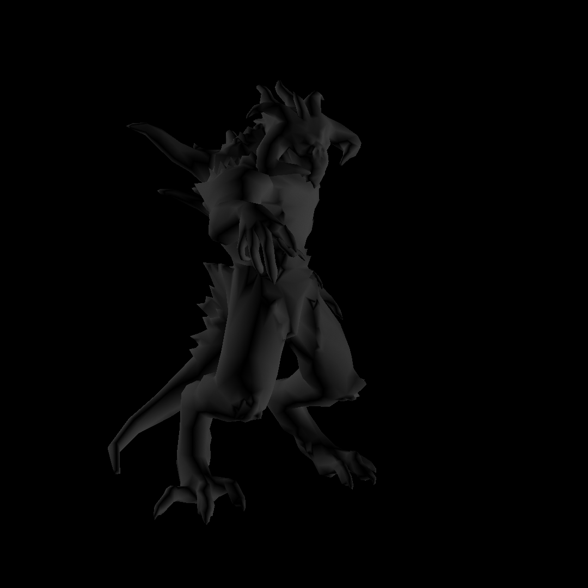

# Rensy

A customizable OBJ model renderer.

## Showcase

Vertex rendering:

Wireframe rendering with perspective:

Bounding box rendering with random colour generation and fog:

Depth buffer rendering:

Flat shading rendering with perspective:

Gouraud shading rendering with perspective:

Phong shading renderer with perspective:

